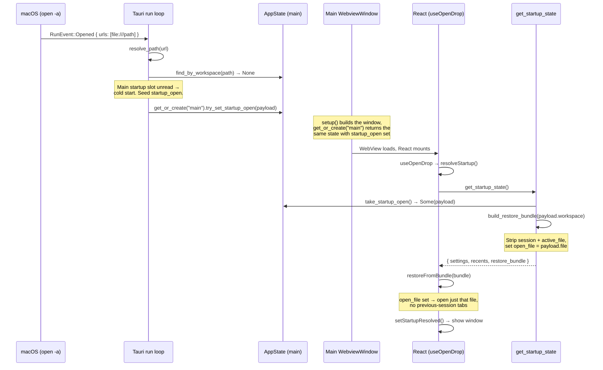
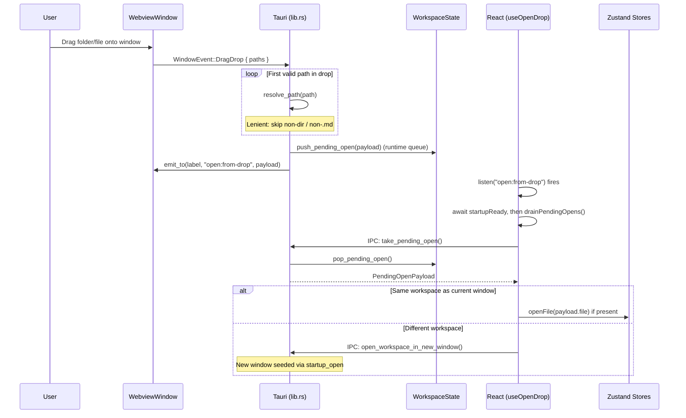
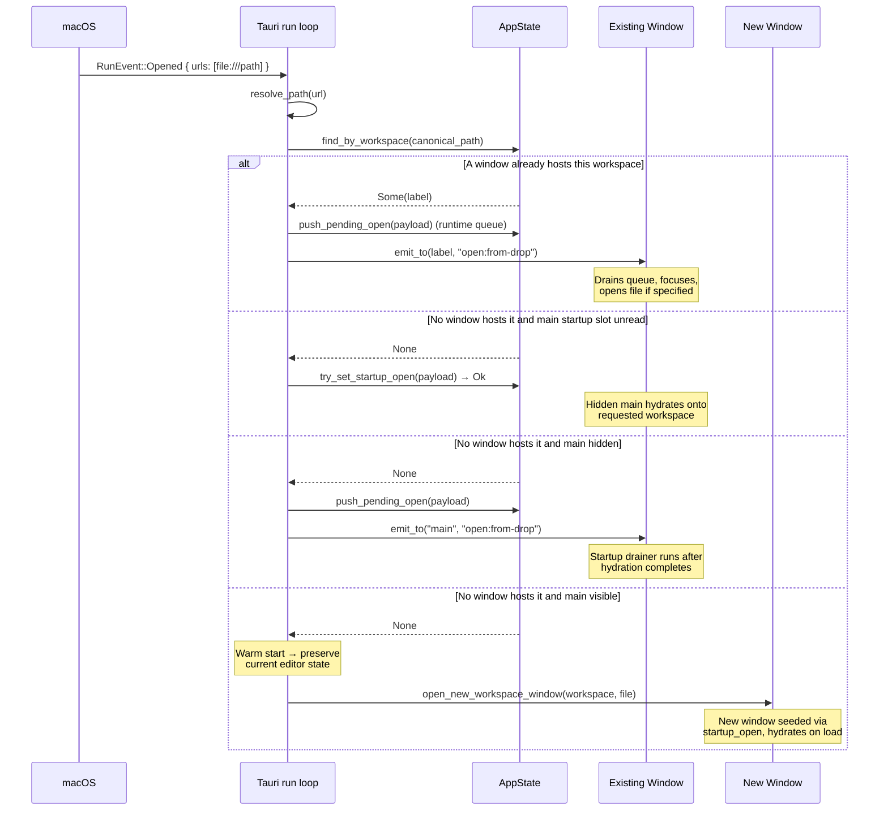
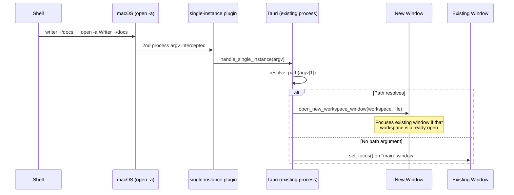
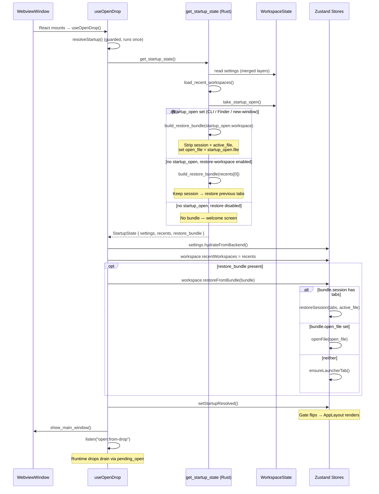

# Writer Open Flows

How files and folders reach the editor from every entry point.

There are **two distinct open mechanisms**, deliberately kept separate:

- **`startup_open`** — a single `Option<PendingOpenPayload>` seeded in Rust
  before `get_startup_state` reads it. For new windows this happens during
  window creation; for macOS cold-start `RunEvent::Opened`, it can happen while
  the main webview exists but is still hidden and unhydrated. Read exactly once
  during startup hydration. Same lifecycle as settings: set before first render,
  consumed during the first render.
- **`pending_open`** — a per-window queue for runtime drag-and-drop / dock drops
  onto an _already-running_ window. Drained by the frontend via the
  `open:from-drop` event + `take_pending_open` IPC.

Both feed the single `get_startup_state` IPC (for startup) or the
`restoreFromBundle` path, so React's first render already has full content.

## Path Resolution (shared)

Every entry point funnels through `open_target::classify()`:

```
Input path
  ├─ is_dir?    → { workspace: canonicalize(path),   file: None }
  ├─ is_file?
  │   └─ .md/.markdown (case-insensitive)?
  │       → { workspace: canonicalize(parent), file: canonicalize(path) }
  └─ otherwise  → None (lenient) / Error (strict CLI)
```

## 1. Cold Start (`writer .`, Finder open, dock drop while not running)

The `writer` symlink invokes the same binary as the GUI app. `main.rs`
dispatches on argv\[0\]: basename `writer` → CLI launcher, `Writer` → Tauri app.

On macOS the open target is **not** delivered through argv — `open -a Writer
/path` (which the CLI launcher, Finder, and dock all use) delivers it via the
`RunEvent::Opened` system event. That event can fire before `setup()` builds the
main window or after Tauri has built the still-hidden webview but before React
calls `get_startup_state`. In either case the handler seeds `startup_open` as
long as that startup slot has not been read yet. The webview then reads it
during hydration — a single window, no duplicate.



On Linux/Windows the path arrives through argv instead; `setup()` reads
`std::env::args()[1]` and calls `set_startup_open` directly (gated behind
`#[cfg(not(target_os = "macos"))]`).

## 2. Runtime Drag-and-Drop onto a Window

When the app is already running and the user drops a file/folder onto a window,
the per-window `pending_open` queue + `open:from-drop` event carry it. This path
never touches `startup_open`.



## 3. Dock Drop / Finder Open While Running

Dragging onto the dock icon (or double-clicking a `.md` in Finder via the
`fileAssociations` registration) fires `RunEvent::Opened`. The handler routes by
whether a window already hosts the workspace, whether the main startup slot is
still unread, and whether the main window is already visible.



The cold-start branch of this same handler is covered in flow 1 — it seeds the
main window while `startup_open` is still readable instead of spawning a new one.

## 4. Second Launch (Single-Instance Plugin)

When Writer is already running and the user runs `writer .` again, the OS hands
the second process's argv to the existing process via
`tauri-plugin-single-instance`.



## 5. New Window (`open_new_workspace_window`)

Every secondary window — whether opened from the frontend
(`open_workspace_in_new_window`), the single-instance plugin, or a warm dock
drop — is seeded the same way: a fresh `WorkspaceState` is created, its
`startup_open` is set, and the window's webview reads it through the same
`get_startup_state` path as the main window on cold start. If a window already
hosts the requested workspace, it is focused instead of duplicated.

## 6. Unified Startup (per-window)

Every window — main or secondary — runs this once. The single `get_startup_state`
IPC eliminates the waterfall of separate settings/recents/workspace fetches.



## Key Design Decisions

- **Single source of truth per concern**: `startup_open` owns the _initial_ open
  (seeded before `get_startup_state` reads it); `pending_open` owns _runtime_
  drops (queue + event). Their consumers do not overlap, which removes the
  cold-start double-open and the race where a runtime event clobbered startup.

- **Explicit open ≠ session restore**: when `startup_open` is set, the restore
  bundle's session and active file are stripped and `open_file` carries the
  request. So `writer file.md` opens just that file, not the previous session's
  tabs. With no `startup_open`, the bundle keeps the session and restores tabs.

- **One IPC, one render**: `get_startup_state` bundles settings + recents + the
  prefetched restore bundle. React hydrates everything before flipping the
  startup gate, so the first visible frame is the full editor — no welcome
  screen flash, no second IPC waterfall.

- **Canonical paths everywhere**: paths are canonicalized on the Rust side
  (`/var` → `/private/var` on macOS) so watcher events, sidebar entries, and
  window lookups (`find_by_workspace`) all key off the same string.

- **Per-window isolation**: each window has its own `WorkspaceState` (workspace
  root, file index, watcher, settings layer, `startup_open`, `pending_open`).
  Concurrent session saves serialize through a process-wide lock.

- **Lenient vs. strict resolution**: drag-drop and `RunEvent::Opened` use
  `resolve_path` (returns `None` for unsupported files). The CLI uses
  `validate_and_resolve` (typed error for stderr).
